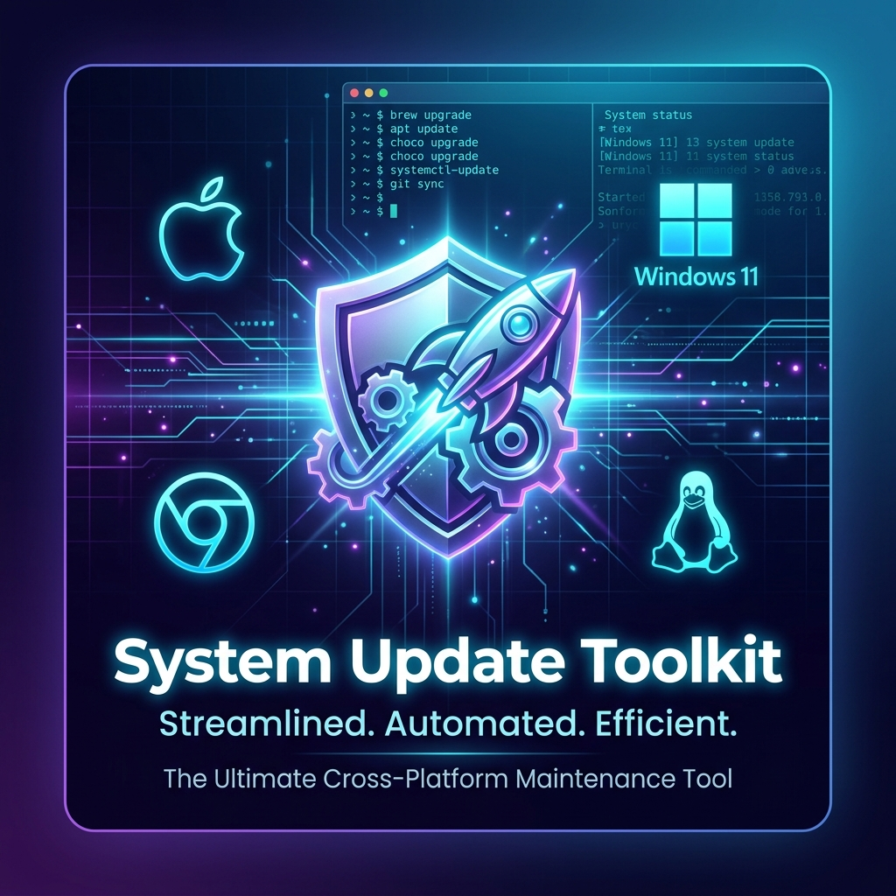
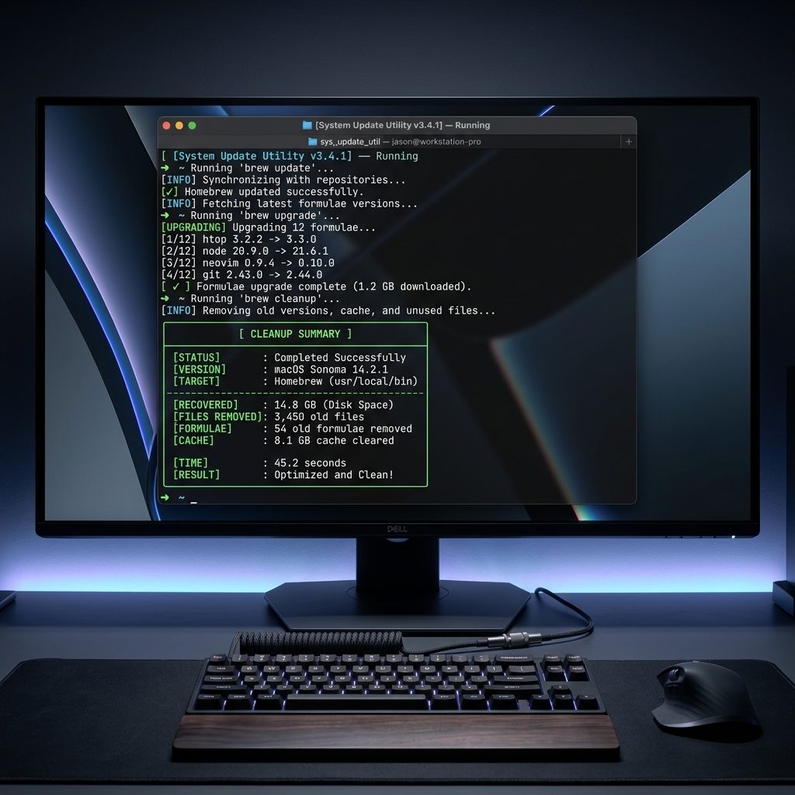

# 🚀 System Update Toolkit — Cross-Platform System Maintenance & Cleanup Automation

<div align="center">

[](LICENSE)
[](https://github.com/nilesh-gore/system-update-toolkit/releases)
[](https://www.shellcheck.net/)
[](https://github.com/nilesh-gore/system-update-toolkit/actions/workflows/shellcheck.yml)
[](https://github.com/nilesh-gore/system-update-toolkit/actions/workflows/powershell.yml)
[](https://securityscorecards.dev/viewer/?uri=github.com/nilesh-gore/system-update-toolkit)
[](#-supported-platforms)
<br>
[](https://github.com/nilesh-gore/system-update-toolkit)
[](https://github.com/nilesh-gore/system-update-toolkit)
[](https://github.com/nilesh-gore/system-update-toolkit/commits/main)
[](https://github.com/nilesh-gore/system-update-toolkit/graphs/commit-activity)
[](https://github.com/nilesh-gore/system-update-toolkit/issues)
[](https://github.com/nilesh-gore/system-update-toolkit/graphs/contributors)
[](https://github.com/nilesh-gore/system-update-toolkit/pulls)
<br>
[](https://github.com/nilesh-gore/system-update-toolkit/stargazers)
[](https://github.com/nilesh-gore/system-update-toolkit/network/members)

**Stop typing the same 10 update-and-cleanup commands by hand, on every machine, every week.**
One script detects your OS and runs the right maintenance routine — updates, cache purges, disk recovery, and a before/after summary — safely and interactively. Nothing destructive runs without your say-so.

> *One script. Five platforms. Gigabytes recovered.* 💾

**⚡ Try it in 10 seconds:**

```bash
curl -fsSL https://raw.githubusercontent.com/nilesh-gore/system-update-toolkit/main/install.sh | sh
```

*macOS · Ubuntu/Debian · Fedora/RHEL · ChromeOS — see [Quick Start](#-quick-start) for Windows and the git-clone route.*



*The ultimate premium maintenance suite for developers*

</div>

---

## 📖 Table of Contents

- [About](#-about)
- [Supported Platforms](#-supported-platforms)
- [Features at a Glance](#-features-at-a-glance)
- [Quick Start](#-quick-start)
- [Detailed Script Breakdown](#-detailed-script-breakdown)
- [Comparison Matrix](#-comparison-matrix)
- [Requirements](#-requirements)
- [Screenshots & Terminal Output](#-screenshots--terminal-output)
- [Troubleshooting](#-troubleshooting)
- [Automation & Scheduling](#-automation--scheduling)
- [FAQ](#-frequently-asked-questions)
- [Contributing](#-contributing)
- [License](#-license)

---

## 📌 About

**System Update Utility** is a collection of lightweight, interactive shell scripts designed to automate the tedious process of keeping your operating system, packages, and development tools up to date.

Whether you're a developer maintaining multiple machines, a sysadmin managing servers, or a power user who wants a clean system — this toolkit has you covered.

### 🎯 Key Benefits

| Benefit | Description |
| :--- | :--- |
| ⏱️ **Time Saver** | One command replaces 10+ manual steps |
| 🧹 **Disk Recovery** | Automatically cleans caches, old versions, and temp files |
| 🛡️ **Safe Dry Run** | Use `-d` to see what will happen before touching any data |
| 🔔 **Desktop Alerts** | Native OS notifications when maintenance is complete |
| 🗓️ **Auto-Schedule** | Use `--schedule` to set up weekly automated maintenance |
| 🎨 **Premium UI** | Beautiful ANSI color-coded output with progress indicators |
| 🔄 **Interactive** | Choose exactly what to clean — nothing runs without your consent |
| 📊 **Recovery Summary**| See exactly how much disk space was recovered |
| ⚠️ **Storage Warning**| Instant alert when free space drops below 10 GB to prevent system lag |

---

## 🖥️ Supported Platforms

<table>
<tr>
<td align="center"><b>🐧 Ubuntu / Debian</b><br>APT<br><code>update_util.sh</code></td>
<td align="center"><b>🎩 Fedora / RHEL</b><br>DNF<br><code>fedora_update_util.sh</code></td>
<td align="center"><b>🍎 macOS</b><br>Homebrew<br><code>brew_update_util.sh</code></td>
<td align="center"><b>🪟 Windows</b><br>PowerShell + Winget<br><code>win_update_util.ps1</code></td>
<td align="center"><b>💻 ChromeOS</b><br>Crostini (Linux)<br><code>chromeos_update_util.sh</code></td>
</tr>
</table>

---

## ✨ Features at a Glance

### 🍎 macOS — `brew_update_util.sh`
- ✅ Updates Homebrew definitions (`brew update`)
- ✅ Smart detection of outdated formulae and casks before upgrading
- ✅ Optional **Greedy Mode** for casks that auto-update (Chrome, Slack, VS Code, etc.)
- ✅ Removes unused dependencies (`brew autoremove`)
- ✅ Runs `brew cleanup` to purge old versions
- ✅ Optional cache purge (`~/Library/Caches/Homebrew`)
- ✅ Integrated `brew doctor` health check
- ✅ Detects running Homebrew background services and **autorestarts** updated ones
- ✅ Interactive terminal history clearing (supports both Zsh and Bash)
- ✅ Real-time disk partition space tracking via `df` (total physical storage reclaimed)
- ✅ **Dry Run Support** (`-d`): Preview cleanup actions safely
- ✅ **Desktop Notifications**: Pings you when updates are done
- ✅ **Yes to All** mode: type `a` at any prompt, or use `-y` flag to auto-approve everything
- ✅ **Low Storage Alert**: Native terminal and desktop notification warnings if system free space drops below 10 GB

### 🐧 Ubuntu / Debian — `update_util.sh`
- ✅ Full system update (`apt-get update` + `full-upgrade`)
- ✅ Fixes broken packages and installs missing dependencies
- ✅ Deep cleanup: APT cache, app caches (`~/.cache`), and thumbnail directories
- ✅ Systemd journal log rotation (keeps only last 7 days)
- ✅ Snap package refresh and old revision removal
- ✅ Package integrity verification via `debsums`
- ✅ System file consistency check (`apt-get check`)
- ✅ Logs all operations to `/var/log/sysupdate.log`
- ✅ Real-time disk partition space tracking via `df` (total physical storage reclaimed)
- ✅ **Yes to All** mode: type `a` at any prompt to auto-approve all remaining prompts
- ✅ **Low Storage Alert**: Native warning and desktop notifications if system free space drops below 10 GB

### 🎩 Fedora / RHEL / CentOS — `fedora_update_util.sh`
- ✅ Next-gen **DNF5** package manager support with seamless `dnf` fallback
- ✅ Full system update (`dnf upgrade --refresh` / `dnf5 upgrade --refresh`)
- ✅ Removes unused dependencies (`dnf autoremove`)
- ✅ Deep cleanup: DNF cache (`dnf clean all`), app caches (`~/.cache`)
- ✅ Systemd journal log rotation (keeps only last 7 days)
- ✅ Flatpak app updates and unused runtime removal
- ✅ Optional Snap package refresh and old revision removal
- ✅ Real-time disk partition space tracking via `df` (total physical storage reclaimed)
- ✅ **Yes to All** mode: type `a` at any prompt to auto-approve all remaining prompts
- ✅ **Low Storage Alert**: Native warning and desktop notifications if system free space drops below 10 GB

### 🪟 Windows — `win_update_util.ps1`
- ✅ Integrated execution from the **Shell wrapper** (`toolkit.sh`) in MSYS/Git Bash
- ✅ Lists and upgrades all apps via **Winget** (Windows Package Manager)
- ✅ Optional `--include-unknown` flag for comprehensive upgrades
- ✅ WSL kernel update (`wsl --update`)
- ✅ Native Disk Cleanup tool integration (`cleanmgr`)
- ✅ Purges system and user `%TEMP%` directories
- ✅ Clears PowerShell history and PSReadLine history securely with **robust locking protection**
- ✅ Native **.NET Toast Notifications** (`System.Windows.Forms.NotifyIcon`) on all Windows editions
- ✅ Admin privilege detection with warnings
- ✅ Windows Store app reminder
- ✅ **Yes to All** mode: type `a` at any prompt to auto-approve all remaining prompts
- ✅ **Low Storage Alert**: Native alert banner and toast notification warnings if system partition free space drops below 10 GB

### 💻 ChromeOS — `chromeos_update_util.sh`
- ✅ Full Debian container update (`apt-get update` + `full-upgrade`)
- ✅ Flatpak app updates and unused runtime removal
- ✅ APT cache cleanup (`autoremove` + `autoclean`)
- ✅ Optional global NPM package updates
- ✅ Optional Python pip upgrade and outdated package listing
- ✅ Interactive terminal history clearing
- ✅ Real-time disk partition space tracking via `df`
- ✅ **Yes to All** mode: type `a` at any prompt to auto-approve all remaining prompts
- ✅ **Low Storage Alert**: Native warnings and desktop notifications if system container free space drops below 10 GB

---

## 🚀 Quick Start

### Option A: Installer Script (fastest)

Downloads the toolkit to `~/.system-update-toolkit` and offers to run it immediately — nothing else to set up.

```bash
curl -fsSL https://raw.githubusercontent.com/nilesh-gore/system-update-toolkit/main/install.sh | sh
```

### Option B: Clone the Repository (if you'd rather inspect the code first)

```bash
git clone https://github.com/nilesh-gore/system-update-toolkit.git && cd system-update-toolkit && chmod +x toolkit.sh && ./toolkit.sh
```

Or step by step:

```bash
git clone https://github.com/nilesh-gore/system-update-toolkit.git
cd system-update-toolkit
chmod +x toolkit.sh
./toolkit.sh
```

Either way, `toolkit.sh` automatically detects your OS and runs the correct maintenance script.

<details>
<summary><b>Manual Execution (Per OS)</b></summary>
If you prefer to run a specific script directly:

* **🍎 macOS:** `./brew_update_util.sh`
* **🐧 Ubuntu/Debian:** `sudo ./update_util.sh`
* **🎩 Fedora/RHEL:** `sudo ./fedora_update_util.sh`
* **💻 ChromeOS:** `./chromeos_update_util.sh`
* **🪟 Windows:** `powershell -File .\win_update_util.ps1`
</details>

---

## 🔍 Detailed Script Breakdown

### Universal Wrapper: `toolkit.sh`
The primary entry point for all systems. It automatically detects the host OS and delegates to the correct script.
```bash
./toolkit.sh [OPTIONS]

Options:
  -y, --yes     Automatic yes to all prompts
  -d, --dry-run Preview what will happen without changes
  --notify      Send desktop notification on completion
  --schedule    Setup weekly automated maintenance (Unix)
  -h, --help    Show help message
  -v, --version Show version info
```

### macOS: `brew_update_util.sh`
```
Step 1  →  Update Homebrew definitions
Step 2  →  Detect outdated formulae & casks
Step 3  →  Upgrade formulae (if any outdated)
Step 4  →  Upgrade casks (with optional Greedy Mode)
Step 5  →  Remove unused dependencies (autoremove)
Step 6  →  Cleanup old versions (brew cleanup -s)
Step 7  →  Optional: Purge Homebrew cache
Step 8  →  Check running services
Step 9  →  Optional: Run brew doctor
Step 10 →  Display cleanup summary
Step 11 →  Optional: Clear terminal history
```

### Ubuntu / Debian: `update_util.sh`
```
Step 1  →  Capture disk usage (before)
Step 2  →  Update package lists
Step 3  →  Full system upgrade
Step 4  →  Fix broken packages & missing deps
Step 5  →  Remove unused packages (autoremove --purge)
Step 6  →  Clean APT cache, app caches, thumbnails
Step 7  →  Vacuum journal logs (7-day retention)
Step 8  →  Refresh Snap packages & remove old revisions
Step 9  →  Verify package integrity (debsums)
Step 10 →  Capture disk usage (after) & display summary
Step 11 →  Optional: Clear terminal history
Step 12 →  Log to /var/log/sysupdate.log
```

### Fedora / RHEL: `fedora_update_util.sh`
```
Step 1  →  Capture disk usage (before)
Step 2  →  Refresh DNF metadata & upgrade packages
Step 3  →  Remove unused packages (autoremove)
Step 4  →  Clean DNF cache (clean all), app caches, thumbnails
Step 5  →  Vacuum journal logs (7-day retention)
Step 6  →  Update Flatpak apps & remove unused runtimes
Step 7  →  Optional: Refresh Snap packages & remove old revisions
Step 8  →  Capture disk usage (after) & display summary
Step 9  →  Optional: Clear terminal history
Step 10 →  Log to /var/log/sysupdate.log
```

### Windows: `win_update_util.ps1`
```
Step 1  →  Check for Administrator privileges
Step 2  →  List outdated Winget packages
Step 3  →  Optional: Upgrade all Winget packages
Step 4  →  Update WSL kernel
Step 5  →  Launch Disk Cleanup (cleanmgr)
Step 6  →  Optional: Clear temp directories
Step 7  →  Optional: Clear PowerShell history
```

### ChromeOS: `chromeos_update_util.sh`
```
Step 1  →  Update Debian package definitions
Step 2  →  Full system upgrade
Step 3  →  Update Flatpak apps & remove unused runtimes
Step 4  →  Clean APT cache (autoremove + autoclean)
Step 5  →  Optional: Update global NPM packages
Step 6  →  Optional: Update pip & list outdated packages
Step 7  →  Display cleanup summary
Step 8  →  Optional: Clear terminal history
```

---

## 📊 Comparison Matrix

| Feature | 🐧 Debian/Ubuntu | 🎩 Fedora/RHEL | 🍎 macOS | 🪟 Windows | 💻 ChromeOS |
| :--- | :---: | :---: | :---: | :---: | :---: |
| **Package Manager** | `apt` | `dnf` | `brew` | `winget` | `apt` |
| **GUI App Updates** | `snap` | `flatpak` | `cask` | `winget` | `flatpak` |
| **System Upgrade** | ✅ | ✅ | ✅ | ✅ | ✅ |
| **Cache Cleanup** | ✅ | ✅ | ✅ | ✅ | ✅ |
| **Disk Space Recovery** | ✅ | ✅ | ✅ | ✅ | ✅ |
| **Health Check** | `debsums` | — | `brew doctor` | — | `apt-get check` |
| **Log Vacuuming** | ✅ (journald) | ✅ (journald) | — | — | — |
| **Service Monitor** | — | — | ✅ | — | — |
| **Dev Tool Updates** | — | — | — | — | `npm` / `pip` |
| **History Clearing** | ✅ | ✅ | ✅ | ✅ | ✅ |
| **Color-coded Output** | ✅ | ✅ | ✅ | ✅ | ✅ |
| **Interactive Prompts** | ✅ | ✅ | ✅ | ✅ | ✅ |
| **POSIX Compatible** | ✅ | ✅ | ✅ | — | ✅ |
| **Yes to All (`-y`)** | ✅ | ✅ | ✅ | ✅ | ✅ |
| **Low Storage Alerts**| ✅ (10 GB) | ✅ (10 GB) | ✅ (10 GB) | ✅ (10 GB) | ✅ (10 GB) |

---

## 🛠 Requirements

| Platform | Required | Optional |
| :--- | :--- | :--- |
| **Ubuntu/Debian** | Ubuntu/Debian 18.04+, `sudo`, `apt`, `journalctl` | `snap`, `debsums`, `numfmt` (coreutils) |
| **Fedora/RHEL** | Fedora 30+, `sudo`, `dnf`, `journalctl` | `flatpak`, `snap`, `numfmt` |
| **macOS** | macOS 12+, [Homebrew](https://brew.sh) | — |
| **Windows** | Windows 10/11, PowerShell 5.1+, [Winget](https://github.com/microsoft/winget-cli) | Administrator privileges for full cleanup |
| **ChromeOS** | Linux (Crostini) enabled in Settings | `flatpak`, `npm`, `pip3` |

---

## 📸 Screenshots & Terminal Output

<div align="center">
  
</div>


---

## ⚙️ Troubleshooting

<details>
<summary><b>🪟 Windows: Script execution is disabled</b></summary>

```powershell
Set-ExecutionPolicy -ExecutionPolicy RemoteSigned -Scope CurrentUser
```
This allows locally-created scripts to run while still blocking unsigned remote scripts.
</details>

<details>
<summary><b>🍎 macOS: Homebrew not found</b></summary>

Install Homebrew first:
```bash
/bin/bash -c "$(curl -fsSL https://raw.githubusercontent.com/Homebrew/install/HEAD/install.sh)"
```
Then add it to your PATH as instructed by the installer.
</details>

<details>
<summary><b>🐧 Linux: Permission denied</b></summary>

Always run the Linux script with `sudo`:
```bash
sudo ./update_util.sh
```
</details>

<details>
<summary><b>💻 ChromeOS: Linux terminal not available</b></summary>

Go to **Settings → Advanced → Developers → Linux development environment** and turn it on. ChromeOS will set up a Debian container automatically.
</details>

<details>
<summary><b>🐧 Linux: debsums not installed</b></summary>

```bash
sudo apt install debsums
```
This enables package integrity verification. The script will skip this step if not installed.
</details>

---

## ⏰ Automation & Scheduling

### 🐧 Linux — Cron Job
```bash
# Edit crontab
crontab -e

# Run every Sunday at 3 AM
0 3 * * 0 /path/to/update_util.sh >> /var/log/sysupdate.log 2>&1
```

### 🍎 macOS — launchd
```bash
# Create a plist in ~/Library/LaunchAgents/
# Or use a simple cron:
crontab -e
0 3 * * 0 /path/to/brew_update_util.sh >> ~/brew_update.log 2>&1
```

### 🪟 Windows — Task Scheduler
```powershell
# Open Task Scheduler → Create Basic Task
# Trigger: Weekly
# Action: Start a Program
# Program: powershell.exe
# Arguments: -File "C:\path\to\win_update_util.ps1"
```

---

## ❓ Frequently Asked Questions

<details>
<summary><b>Will this delete my personal files?</b></summary>

**No.** The scripts only clean system-managed caches, temporary files, old package versions, and log files. Your documents, projects, and personal data are never touched.
</details>

<details>
<summary><b>Can I run this on a server?</b></summary>

**Yes.** The Linux script (`update_util.sh`) works great on headless servers. All interactive prompts can be bypassed by piping input: `echo "y" | sudo ./update_util.sh`
</details>

<details>
<summary><b>How much disk space can I expect to recover?</b></summary>

It varies by system. Typical results:
- **macOS**: 200MB – 2GB (old Homebrew versions and cache)
- **Linux**: 500MB – 5GB (APT cache, journal logs, old Snaps)
- **Windows**: 1GB – 10GB (temp files, Disk Cleanup)
</details>

<details>
<summary><b>Is it safe to run frequently?</b></summary>

**Absolutely.** Running weekly is recommended. If everything is already up to date, the scripts complete in seconds with no changes.
</details>

<details>
<summary><b>Does it support Arch or other Linux distros?</b></summary>

Currently, **Debian/Ubuntu** (`apt`) and **Fedora/RHEL** (`dnf`) based distros are officially supported. Support for `pacman` (Arch) is planned for future releases. Contributions welcome!
</details>

---

## 🧪 Testing & Verification

We use automated unit tests and static code analysis to guarantee script quality and reliability.

### Unix Shell Scripts
Unix-based shell scripts (`toolkit.sh`, `brew_update_util.sh`, `update_util.sh`, `fedora_update_util.sh`, `chromeos_update_util.sh`) are linted and verified using `shellcheck`:
```bash
shellcheck toolkit.sh brew_update_util.sh update_util.sh fedora_update_util.sh chromeos_update_util.sh
```

### Windows PowerShell Script
The Windows-specific script (`win_update_util.ps1`) is unit tested using **Pester** (the official testing framework for PowerShell).

Pester mock objects are used so that the tests can run **safely on any platform (including macOS/Linux)** inside GitHub Actions CI, without actually making changes, deleting files, or launching Windows apps.

To run the unit tests locally on Windows or macOS/Linux (with PowerShell Core installed):
```powershell
Invoke-Pester -Path .\tests\win_update_util.Tests.ps1 -Output Detailed
```

---

## 🤝 Contributing

Contributions are what make the open-source community such an amazing place to learn, inspire, and create. Any contributions you make are **greatly appreciated**.

1. **Fork** the Project
2. **Create** your Feature Branch (`git checkout -b feature/AmazingFeature`)
3. **Commit** your Changes (`git commit -m 'feat: add AmazingFeature'`)
4. **Push** to the Branch (`git push origin feature/AmazingFeature`)
5. **Open** a Pull Request

### 💡 Ideas for Contributions
- Add support for Arch Linux (`pacman`) and OpenSUSE (`zypper`)
- Add Chocolatey support for Windows alongside Winget
- Add Docker cleanup logic (dangling images/volumes)
- Implement a "Doctor" health check for Windows/Linux/Fedora

---

## 📝 Changelog

| Version | Date | Changes |
| :--- | :--- | :--- |
| **v2.6.1** | 2026-07-20 | **Reliability & Compatibility Patch**: Fixed the `curl \| sh` installer's confirmation prompt, which could silently consume the script's own remaining lines instead of reading user input in piped/non-interactive contexts. Fixed Windows color output, which previously only rendered correctly on PowerShell 6+ despite PowerShell 5.1 being the documented minimum. Hardened the Debian and ChromeOS cleanup scripts so a single failed cache clear, snap removal, or `apt-get check` no longer aborts the run before the summary is shown. |
| **v2.6** | 2026-05-21 | **Proactive Storage Warning & Testing Release**: Added proactive low disk space checks (10 GB threshold) with native terminal alerts and desktop notifications across all five supported operating systems (macOS, Ubuntu, Fedora, ChromeOS, Windows) to prevent system slowdowns. Relocated and engineered a fully mocked, platform-agnostic Pester test suite in a dedicated `tests/` folder for seamless local testing on macOS/Linux and standard GitHub Actions CI integration. |
| **v2.5** | 2026-05-20 | **Premium & Robustness Update**: Dynamic DNF5 support for Fedora 41+, premium Windows native .NET toast notifications, active Windows execution in standard wrapper `toolkit.sh` via Git Bash, secure scheduling using POSIX-compliant `mktemp`, robust PowerShell history wiping (`Clear-Content`), and real-time physical partition space tracking via `df` |
| **v2.4** | 2026-05-13 | **Trust & Automation Update**: Added `-d`/`--dry-run` mode, native desktop notifications, and `--schedule` for automated weekly maintenance |
| **v2.3** | 2026-05-11 | **Major UX Overhaul**: Added `-y`/`--yes` CLI flags, modernized interactive prompts with `[y/n/a]` options, and added `toolkit.sh` unified wrapper |
| **v2.2** | 2026-05-08 | Added GitHub Actions CI (ShellCheck & PSScriptAnalyzer), concurrency rules, universal curl installer, docs website, and fixed all linting warnings |
| **v2.1** | 2026-05-08 | Added `a` (yes to all) interactive option across all prompts, `--help`/`--version` flags, made Linux cache wipes interactive, added disk stats & `apt-get check` to ChromeOS, added cleanup summary to Windows, fixed README inaccuracies, added LICENSE file |
| **v2.0** | 2026-05-07 | Added Windows & ChromeOS support, premium ANSI visuals, `brew doctor`, `autoremove`, greedy cask upgrades, comparison matrix |
| **v1.0** | Initial | Linux (`apt`) and macOS (`brew`) update utilities |

---

## ⭐ Star History

If this project saved you time or disk space, **please give it a ⭐!**
It costs nothing but helps others discover this toolkit. Every star counts! 🙏

[](https://github.com/nilesh-gore/system-update-toolkit)

---

## 📄 License

Distributed under the **MIT License**. See [`LICENSE`](LICENSE) for more information.

---

## 🔍 Keywords

`system-update` `system-maintenance` `cleanup-script` `disk-cleanup` `cache-cleaner` `homebrew-update` `apt-update` `winget-update` `shell-script` `powershell-script` `linux-maintenance` `macos-maintenance` `windows-maintenance` `chromeos` `devops-tools` `automation` `sysadmin` `terminal-utility` `package-manager` `disk-space-recovery`

---

<div align="center">

**Made with ❤️ by [Nilesh Gore](https://github.com/nilesh-gore)**

*Keep your systems clean. Keep your terminal beautiful.*

⭐ **Found this useful? Star the repo and share it!** ⭐

[⬆ Back to Top](#-system-update-toolkit--cross-platform-system-maintenance--cleanup-automation)

</div>
